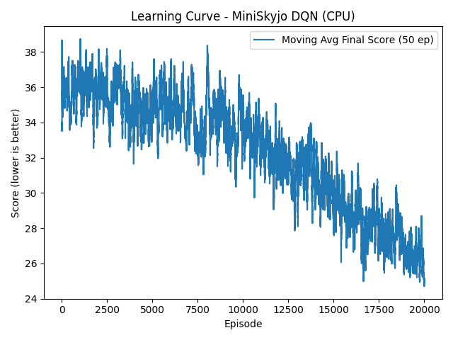

# Zero to Skyjo

## Objectif du projet
L'objectif de ce projet est de développer une intelligence artificielle capable de jouer au Skyjo, un jeu de cartes stratégique, tout en minimisant son score. Ce projet est structuré en plusieurs phases pour garantir une progression méthodique et efficace.

### Règles du Skyjo
- Le jeu se joue avec un plateau de cartes numérotées.
- Chaque joueur a un tableau de cartes cachées.
- Le but est de minimiser son score en remplaçant ses cartes par des cartes de plus faible valeur.
- Les joueurs jouent à tour de rôle en tirant des cartes et en décidant de les garder ou de les défausser.

## Phase 1: Expérimentation et choix de l'architecture

### Objectif
L'objectif de cette phase est d'expérimenter différentes architectures de modèles pour identifier celle qui est la plus adaptée au problème. Pour cela, nous utilisons une version simplifiée du Skyjo, appelée "Mini Skyjo".

### Règles simplifiées du Mini Skyjo
- Le jeu utilise un deck de 36 cartes, avec des valeurs allant de 1 à 6, chaque valeur ayant 6 copies.
- Chaque joueur commence avec 6 cartes face cachée.
- À chaque tour, deux cartes sont proposées : une visible et une cachée. Le joueur doit choisir l'une des deux cartes et remplacer une carte de sa main.
- Le jeu se termine lorsque toutes les cartes du joueur sont visibles ou que le deck contient moins de 2 cartes.
- Le score final est la somme des valeurs des cartes visibles plus le nombre d'échanges effectués.

### Entraînement et test du modèle
- Pour entraîner le modèle sur le Mini Skyjo, utilisez la commande suivante :
  ```
  uv run train_mini_skyjo.py --train --episodes 3000
  ```
- Pour tester le modèle avec un affichage du jeu et des étapes dans le terminal, utilisez :
  ```
  uv run train_mini_skyjo.py --demo
  ```

### Résultats
Les performances de l'architecture du modèle sur le Mini Skyjo sont bonnes, ce qui valide l'approche choisie pour cette phase. Les métriques et courbes d'apprentissage montrent une amélioration significative au fil des épisodes d'entraînement.



## Phase 2: Intégration avec l'API

### Objectif
La deuxième phase consiste à connecter tous les éléments développés. Cela inclut l'intégration de l'API, développée en Rust par Romain BOURDAIN, avec le modèle d'intelligence artificielle. Cette étape permettra de passer d'une version simplifiée à une version complète et interactive du Skyjo, où l'IA pourra interagir avec une API robuste et performante.